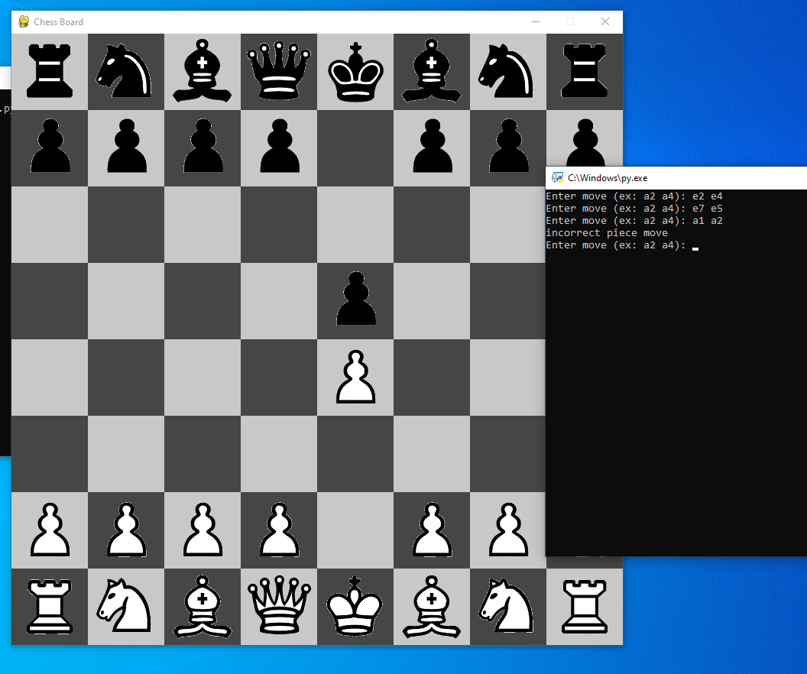

# Jak grać w szachy

Plik chess.py to plik gry.
Plik "position" to plik, w którym zapisywany jest aktualny stan gry.
Plik board.py to program, który odczytuje plik "position" i wyświetla szachownicę na jego podstawie.

Obydwa programy w języku Python powinny znajdować się w tym samym folderze. Wystarczy uruchomić oba z nich (board.py służy tylko do wyświetlania planszy i nie jest potrzebny do działania programu), a następnie grać w szachy w programie chess.py. Zmiany na planszy będą widoczne.

Plansza prawdopodobnie będzie miała opóźnienie z powodu sposobu jej programowania. Miałem zamiar użyć chess.py do stworzenia szachowego AI, dlatego nie zwracałem zbytnio uwagi na aspekty wizualne. Mimo że plansza może wydawać się opóźniona, będzie działać po wykonaniu ruchu w programie chess.py.

# Jak to działa

Najpierw inicjowane są plansza i zmienne. Plansza to lista 8 list, z których każda zawiera 8 elementów, tworząc tym samym szachownicę 8x8.

Każdy pionek ma swoją wartość liczbową: pionek = 1, skoczek = 2, goniec = 3, wieża = 5, królowa = 9, a król = 10. Wartości czarnych pionków są ujemne: pionek = -1, skoczek = -2, goniec = -3, wieża = -5, królowa = -9, król = -10.

Tworzone są 6 funkcji, po jednej dla każdego pionka, służące do sprawdzania możliwych ruchów: pionka, skoczka, gońca, wieży, królowej i króla.

Następnie zapisywany jest ruch gracza i zmieniany z formy ciągu znaków na listę współrzędnych, na przykład: e2 e4 -> [[4, 1][4, 3]], co oznacza początkową pozycję pionka i jego nowe położenie.

Na podstawie pionka, którym porusza się gracz, używana jest odpowiednia funkcja do znalezienia jego legalnych ruchów i sprawdzenia, czy ruch gracza jest zgodny z tymi ruchami.

Jeśli tak, następuje zmiana tury na gracza czarnego, w przeciwnym razie gracz zostaje poproszony o ponowne wprowadzenie ruchu.
